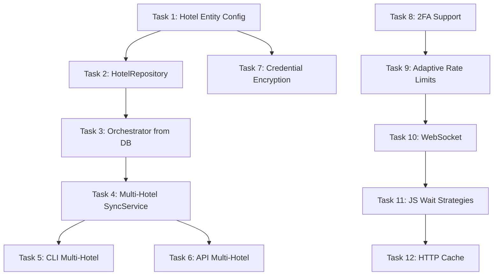

# Multi-Hotel Support & Scraper Limitations Mitigation Plan

> **For Hermes:** Use subagent-driven-development skill to implement this plan task-by-task.

**Goal:** Enable multi-hotel credential management in the database and mitigate current scraper limitations to support production use across multiple hotels.

**Architecture:** Extend existing Hotel entity and SyncService to support multi-hotel operations. Add per-hotel credential management, parallel sync orchestration, and enhanced scraper capabilities (2FA, higher rate limits, WebSocket, JS-heavy pages).

**Tech Stack:** FastAPI, SQLAlchemy 2.x, Celery, Camoufox, Redis, PostgreSQL/SQLite

---

## Part 1: Multi-Hotel Credential Management & Sync Orchestration

### Task 1: Extend Hotel Entity with Per-Hotel Configuration

**Objective:** Add fields to Hotel model for per-hotel scraper configuration (rate limits, timeouts, domain overrides).

**Files:**
- Modify: `src/otelms/domain/entities/__init__.py:29-52` (Hotel class)
- Create: `src/otelms/domain/migrations/versions/YYYYMMDD_HHMM_add_hotel_config.py` (Alembic migration)

**Step 1: Write failing test**

```python
# tests/unit/test_hotel_entity.py
import pytest
from otelms.domain.entities import Hotel

def test_hotel_has_scraper_config_fields():
    hotel = Hotel(
        id="test_hotel",
        name="Test Hotel",
        username="user@test.com",
        password_hash="hash",
        scraper_rate_limit_rpm=60,
        scraper_burst=10,
        scraper_timeout_ms=60000,
        custom_domain="custom.otelms.com",
    )
    assert hotel.scraper_rate_limit_rpm == 60
    assert hotel.scraper_burst == 10
    assert hotel.scraper_timeout_ms == 60000
    assert hotel.custom_domain == "custom.otelms.com"
```

**Step 2: Run test to verify failure**
Run: `pytest tests/unit/test_hotel_entity.py::test_hotel_has_scraper_config_fields -v`
Expected: FAIL — "Hotel has no attribute scraper_rate_limit_rpm"

**Step 3: Write minimal implementation**

```python
# In Hotel class (src/otelms/domain/entities/__init__.py)
# Add after line 41 (last_sync_at):
scraper_rate_limit_rpm: Mapped[int] = mapped_column(Integer, default=30)
scraper_burst: Mapped[int] = mapped_column(Integer, default=5)
scraper_timeout_ms: Mapped[int] = mapped_column(Integer, default=60000)
scraper_navigation_timeout_ms: Mapped[int] = mapped_column(Integer, default=45000)
scraper_selector_timeout_ms: Mapped[int] = mapped_column(Integer, default=20000)
custom_domain: Mapped[Optional[str]] = mapped_column(String(255), nullable=True)
use_custom_domain: Mapped[bool] = mapped_column(default=False)
```

**Step 4: Run test to verify pass**
Run: `pytest tests/unit/test_hotel_entity.py::test_hotel_has_scraper_config_fields -v`
Expected: PASS

**Step 5: Generate and run migration**
```bash
cd D:\Coders\00_activos\scraping_otelms_api
uv run alembic revision --autogenerate -m "add hotel scraper config fields"
uv run alembic upgrade head
```

**Step 6: Commit**
```bash
git add src/otelms/domain/entities/__init__.py migrations/versions/
git commit -m "feat: add per-hotel scraper configuration fields"
```

---

### Task 2: Update HotelRepository with Multi-Hotel Queries

**Objective:** Add methods to fetch hotels with their scraper config for orchestration.

**Files:**
- Modify: `src/otelms/domain/repositories/__init__.py:13-52` (HotelRepository)

**Step 1: Write failing test**

```python
# tests/unit/test_hotel_repository.py
@pytest.mark.asyncio
async def test_get_active_with_scraper_config(hotel_repo, session):
    # Create hotels with different configs
    await hotel_repo.create(id="h1", name="Hotel 1", username="u1@test.com", password_hash="h", scraper_rate_limit_rpm=60)
    await hotel_repo.create(id="h2", name="Hotel 2", username="u2@test.com", password_hash="h", scraper_rate_limit_rpm=30)
    await session.commit()

    hotels = await hotel_repo.get_active_with_config()
    assert len(hotels) == 2
    assert all(hasattr(h, 'scraper_rate_limit_rpm') for h in hotels)
```

**Step 2: Run test to verify failure**
Run: `pytest tests/unit/test_hotel_repository.py::test_get_active_with_scraper_config -v`
Expected: FAIL — "HotelRepository has no method get_active_with_config"

**Step 3: Write minimal implementation**

```python
# In HotelRepository class (src/otelms/domain/repositories/__init__.py)
async def get_active_with_config(self) -> Sequence[Hotel]:
    """Obtiene hoteles activos con configuración de scraper."""
    stmt = select(Hotel).where(Hotel.is_active == True).order_by(Hotel.name)
    result = await self.session.execute(stmt)
    return result.scalars().all()

async def get_by_id_with_config(self, hotel_id: str) -> Hotel | None:
    """Obtiene hotel con configuración completa."""
    stmt = select(Hotel).where(Hotel.id == hotel_id)
    result = await self.session.execute(stmt)
    return result.scalar_one_or_none()
```

**Step 4: Run test to verify pass**
Run: `pytest tests/unit/test_hotel_repository.py::test_get_active_with_config -v`
Expected: PASS

**Step 5: Commit**

---

### Task 3: Refactor ScrapingOrchestrator to Accept Hotel Config from DB

**Objective:** Modify ScrapingOrchestrator to read per-hotel config instead of using global settings.

**Files:**
- Modify: `src/otelms/scraping/orchestrator.py:49-92` (ScrapingOrchestrator.__init__, initialize)
- Modify: `src/otelms/scraping/browser.py` (BrowserPool to accept per-hotel config)

**Step 1: Write failing test**

```python
# tests/unit/test_orchestrator_config.py
@pytest.mark.asyncio
async def test_orchestrator_uses_hotel_config():
    hotel = Hotel(id="h1", username="u@test.com", password_hash="h", 
                  scraper_rate_limit_rpm=60, scraper_burst=10)
    
    orchestrator = ScrapingOrchestrator.from_hotel(hotel)
    assert orchestrator.rate_limit_rpm == 60
    assert orchestrator.burst == 10
```

**Step 2: Run test to verify failure**

**Step 3: Write minimal implementation**

```python
# In ScrapingOrchestrator class
@classmethod
async def from_hotel(cls, hotel: Hotel) -> "ScrapingOrchestrator":
    """Crea orquestador desde entidad Hotel con config de BD."""
    orchestrator = cls(
        hotel_id=hotel.id,
        username=hotel.username,
        password=hotel.password_hash,  # Will need decryption helper
        headless=hotel.scraper_headless if hasattr(hotel, 'scraper_headless') else True,
        base_domain=hotel.custom_domain if hotel.use_custom_domain else hotel.domain,
    )
    # Store per-hotel config
    orchestrator.rate_limit_rpm = hotel.scraper_rate_limit_rpm
    orchestrator.burst = hotel.scraper_burst
    orchestrator.timeout_ms = hotel.scraper_timeout_ms
    return orchestrator

async def initialize(self) -> None:
    # ... existing code ...
    # Use self.rate_limit_rpm instead of settings.scraper_rate_limit_requests_per_minute
    # Pass per-hotel config to rate_limiter
```

**Step 4: Run test to verify pass**

**Step 5: Commit**

---

### Task 4: Create Multi-Hotel Sync Service (Orchestrator)

**Objective:** Add SyncService method to sync all active hotels in parallel with proper error isolation.

**Files:**
- Modify: `src/otelms/services/sync_service.py` (Add sync_all_hotels method)
- Modify: `src/otelms/tasks/scraping_tasks.py` (Update Celery tasks)

**Step 1: Write failing test**

```python
# tests/integration/test_multi_hotel_sync.py
@pytest.mark.asyncio
async def test_sync_all_hotels(sync_service, mock_orchestrator_factory):
    # Create 3 hotels
    hotels = [Hotel(id=f"h{i}", ...) for i in range(3)]
    
    result = await sync_service.sync_all_hotels()
    
    assert result.success is True
    assert result.hotels_synced == 3
    assert len(result.errors) == 0  # Individual failures shouldn't fail all
```

**Step 2: Run test to verify failure**

**Step 3: Write minimal implementation**

```python
# In SyncService class
async def sync_all_hotels(self, target_date: Optional[str] = None, max_concurrent: int = 3) -> MultiHotelSyncResult:
    """Sincroniza todos los hoteles activos en paralelo."""
    hotels = await self.hotel_repo.get_active_with_config()
    
    semaphore = asyncio.Semaphore(max_concurrent)
    
    async def sync_one(hotel: Hotel) -> HotelSyncResult:
        async with semaphore:
            try:
                svc = SyncService.from_hotel(hotel)
                await svc.initialize()
                result = await svc.full_sync(target_date)
                return HotelSyncResult(hotel_id=hotel.id, success=result.success, error=result.error)
            except Exception as e:
                logger.error("Hotel sync failed", hotel_id=hotel.id, error=str(e))
                return HotelSyncResult(hotel_id=hotel.id, success=False, error=str(e))
            finally:
                await svc.close()
    
    results = await asyncio.gather(*[sync_one(h) for h in hotels])
    
    return MultiHotelSyncResult(
        total_hotels=len(hotels),
        successful=sum(1 for r in results if r.success),
        failed=sum(1 for r in results if not r.success),
        details=results,
    )
```

**Step 4: Update Celery task**

```python
# In src/otelms/tasks/scraping_tasks.py
@shared_task(bind=True, max_retries=1)
def sync_all_hotels(self, target_date: Optional[str] = None):
    """Celery task to sync all active hotels."""
    # Create new SyncService instance
    # Run sync_all_hotels
    pass
```

**Step 5: Run test to verify pass**

**Step 6: Commit**

---

### Task 5: Update CLI Commands for Multi-Hotel Operations

**Objective:** Add CLI options to target specific hotel or all hotels.

**Files:**
- Modify: `src/otelms/cli.py` (scraper, sync commands)

**Step 1: Write failing test**

```python
# tests/unit/test_cli_multi_hotel.py
def test_cli_scraper_all_hotels(runner):
    result = runner.invoke(app, ["scraper", "--all-hotels"])
    assert result.exit_code == 0
    assert "Syncing all hotels" in result.output
```

**Step 2: Run test to verify failure**

**Step 3: Write minimal implementation**

```python
# In cli.py - modify run_scraper and run_sync
@app.command(name="scraper")
def run_scraper(
    hotel_id: Optional[str] = typer.Option(None, "--hotel-id", help="Hotel ID (optional, uses default from .env)"),
    all_hotels: bool = typer.Option(False, "--all-hotels", help="Scrape all active hotels"),
    # ... existing options ...
):
    if all_hotels:
        # Call sync_service.sync_all_hotels()
    else:
        # Use hotel_id or default from settings
```

```python
@app.command(name="sync")
def run_sync(
    hotel_id: Optional[str] = typer.Option(None, "--hotel-id"),
    all_hotels: bool = typer.Option(False, "--all-hotels"),
    # ... existing options ...
):
    # Similar logic
```

**Step 4: Run test to verify pass**

**Step 5: Commit**

---

### Task 6: Update API Endpoints for Per-Hotel Sync

**Objective:** Add endpoints to trigger sync for specific hotel or all hotels.

**Files:**
- Modify: `src/otelms/api/routes/reservations.py` (sync endpoints)

**Step 1: Write failing test**

```python
# tests/integration/test_api_multi_hotel.py
def test_sync_all_hotels_endpoint(client, api_key):
    response = client.post("/reservations/sync/all", headers={"X-API-Key": api_key})
    assert response.status_code == 202  # Async
    assert "task_id" in response.json()
```

**Step 2: Run test to verify failure**

**Step 3: Write minimal implementation**

```python
# In reservations.py router
@router.post("/sync/all", response_model=dict)
async def sync_all_hotels(
    target_date: Optional[str] = Query(None),
    background_tasks: BackgroundTasks = None,
    api_key: ApiKey = Depends(verify_api_key),
) -> dict:
    """Trigger async sync for all active hotels."""
    task = sync_all_hotels.delay(target_date)
    return {"task_id": task.id, "status": "queued"}

@router.post("/sync/{hotel_id}", response_model=dict)
async def sync_hotel(
    hotel_id: str,
    target_date: Optional[str] = Query(None),
    api_key: ApiKey = Depends(verify_api_key),
) -> dict:
    """Trigger async sync for specific hotel."""
    task = sync_hotel_task.delay(hotel_id, target_date)
    return {"task_id": task.id, "status": "queued"}
```

**Step 4: Run test to verify pass**

**Step 5: Commit**

---

### Task 7: Add Hotel Credential Management API

**Objective:** Secure API to manage hotel credentials (create, rotate, decrypt for scraper).

**Files:**
- Modify: `src/otelms/api/routes/hotels.py` (add password rotation endpoint)
- Create: `src/otelms/utils/crypto.py` (encryption helpers)

**Step 1: Write failing test**

```python
# tests/integration/test_hotel_credentials.py
def test_rotate_hotel_password(client, api_key, test_hotel):
    response = client.post(
        f"/hotels/{test_hotel.id}/rotate-password",
        headers={"X-API-Key": api_key},
        json={"new_password": "new_secure_pass"}
    )
    assert response.status_code == 200
    assert "password rotated" in response.json()["message"]
```

**Step 2: Run test to verify failure**

**Step 3: Write minimal implementation**

```python
# In src/otelms/utils/crypto.py
from cryptography.fernet import Fernet
import os

class CredentialEncryption:
    def __init__(self):
        key = os.getenv("CREDENTIAL_ENCRYPTION_KEY") or Fernet.generate_key()
        self.cipher = Fernet(key)
    
    def encrypt(self, plaintext: str) -> str:
        return self.cipher.encrypt(plaintext.encode()).decode()
    
    def decrypt(self, ciphertext: str) -> str:
        return self.cipher.decrypt(ciphertext.encode()).decode()

credential_encryption = CredentialEncryption()
```

```python
# In Hotel entity - modify password field
password_encrypted: Mapped[str] = mapped_column(String(500), nullable=False)

@property
def password(self) -> str:
    return credential_encryption.decrypt(self.password_encrypted)

@password.setter
def password(self, value: str):
    self.password_encrypted = credential_encryption.encrypt(value)
```

```python
# In hotels.py router
@router.post("/{hotel_id}/rotate-password", response_model=dict)
async def rotate_password(
    hotel_id: str,
    new_password: str = Body(..., embed=True),
    hotel_repo: HotelRepository = Depends(get_hotel_repo),
    api_key: ApiKey = Depends(verify_api_key),
):
    hotel = await hotel_repo.get_by_id(hotel_id)
    if not hotel:
        raise HTTPException(404, "Hotel not found")
    
    hotel.password = new_password  # Uses setter to encrypt
    await hotel_repo.session.flush()
    return {"message": "Password rotated successfully"}
```

**Step 4: Run test to verify pass**

**Step 5: Commit**

---

## Part 2: Scraper Limitations Mitigation

### Task 8: Implement 2FA/MFA Login Support

**Objective:** Add support for Time-based OTP (TOTP) and email/SMS 2FA during login.

**Files:**
- Modify: `src/otelms/scraping/auth.py` (OtelMSAuth class)
- Create: `src/otelms/scraping/two_factor.py` (2FA handlers)

**Step 1: Write failing test**

```python
# tests/unit/test_2fa.py
@pytest.mark.asyncio
async def test_totp_login():
    auth = OtelMSAuth("h1", "user@test.com", "pass", totp_secret="JBSWY3DPEHPK3PXP")
    assert auth.totp_secret == "JBSWY3DPEHPK3PXP"
    
    # Mock page and test 2FA flow
    # ...
```

**Step 2: Write minimal implementation**

```python
# In OtelMSAuth class
def __init__(self, hotel_id: str, username: str, password: str, 
             base_domain: str = "otelms.com",
             totp_secret: Optional[str] = None,
             sms_2fa: bool = False,
             email_2fa: bool = False):
    # ... existing ...
    self.totp_secret = totp_secret
    self.sms_2fa = sms_2fa
    self.email_2fa = email_2fa

async def _perform_login(self, context: BrowserContext) -> bool:
    # ... existing login ...
    
    # Check for 2FA challenge
    if await self._is_2fa_challenge(page):
        if self.totp_secret:
            await self._handle_totp(page)
        elif self.sms_2fa:
            await self._handle_sms_2fa(page)
        elif self.email_2fa:
            await self._handle_email_2fa(page)
        else:
            raise AuthenticationError("2FA required but no method configured")
    
    # Verify post-2FA
    return await self._verify_session(context)

async def _handle_totp(self, page: Page):
    import pyotp
    totp = pyotp.TOTP(self.totp_secret)
    code = totp.now()
    await page.fill("input[name='totp_code']", code)
    await page.click("button[type='submit']")
```

**Step 3: Add pyotp dependency**

```toml
# In pyproject.toml dependencies
"pyotp>=2.9.0",
```

**Step 4: Run test to verify pass**

**Step 5: Commit**

---

### Task 9: Increase Rate Limits with Adaptive Throttling

**Objective:** Implement adaptive rate limiting that increases limits when successful and backs off on 429/errors.

**Files:**
- Modify: `src/otelms/scraping/rate_limiter.py` (TokenBucket, RateLimiter)
- Modify: `src/otelms/scraping/orchestrator.py` (integrate adaptive limiter)

**Step 1: Write failing test**

```python
# tests/unit/test_adaptive_rate_limit.py
@pytest.mark.asyncio
async def test_adaptive_rate_limiter_increases_on_success():
    limiter = AdaptiveRateLimiter(initial_rpm=30, max_rpm=120)
    
    # Simulate 10 successful requests
    for _ in range(10):
        await limiter.acquire()
        await limiter.record_success()
    
    assert limiter.current_rpm > 30  # Should have increased

@pytest.mark.asyncio
async def test_adaptive_rate_limiter_decreases_on_429():
    limiter = AdaptiveRateLimiter(initial_rpm=60)
    
    await limiter.acquire()
    await limiter.record_error(429)  # Rate limited
    
    assert limiter.current_rpm < 60  # Should have decreased
```

**Step 2: Write minimal implementation**

```python
# New class in rate_limiter.py
class AdaptiveRateLimiter:
    def __init__(self, initial_rpm: int = 30, max_rpm: int = 120, min_rpm: int = 10):
        self.current_rpm = initial_rpm
        self.max_rpm = max_rpm
        self.min_rpm = min_rpm
        self.success_count = 0
        self.error_count = 0
        self._bucket = TokenBucket(...)
    
    async def acquire(self):
        await self._bucket.take()
    
    async def record_success(self):
        self.success_count += 1
        self.error_count = 0
        if self.success_count >= 50 and self.current_rpm < self.max_rpm:
            self.current_rpm = min(self.current_rpm * 1.2, self.max_rpm)
            self._bucket.rate = self.current_rpm
            self.success_count = 0
    
    async def record_error(self, status_code: int = 0):
        self.error_count += 1
        self.success_count = 0
        if status_code == 429 or self.error_count >= 3:
            self.current_rpm = max(self.current_rpm * 0.5, self.min_rpm)
            self._bucket.rate = self.current_rpm
            self.error_count = 0
```

**Step 3: Integrate in orchestrator**

```python
# In ScrapingOrchestrator
def __init__(self, ...):
    # ...
    self.adaptive_limiter = AdaptiveRateLimiter(
        initial_rpm=self.rate_limit_rpm,
        max_rpm=120,
    )

async def scrape_calendar(self, ...):
    await self.adaptive_limiter.acquire()
    try:
        # ... scraping ...
        await self.adaptive_limiter.record_success()
    except Exception as e:
        if "429" in str(e):
            await self.adaptive_limiter.record_error(429)
        raise
```

**Step 4: Run test to verify pass**

**Step 5: Commit**

---

### Task 10: Add WebSocket Support for Real-Time Updates

**Objective:** Add WebSocket endpoint for real-time sync status and reservation updates.

**Files:**
- Create: `src/otelms/api/websockets.py` (WebSocket router)
- Modify: `src/otelms/api/main.py` (include websocket router)
- Modify: `src/otelms/services/sync_service.py` (emit progress events)

**Step 1: Write failing test**

```python
# tests/integration/test_websocket.py
@pytest.mark.asyncio
async def test_websocket_sync_progress():
    async with client.websocket_connect("/ws/sync-progress?hotel_id=h1") as ws:
        # Trigger sync
        await sync_service.sync_calendar("2026-01-15")
        
        # Receive progress updates
        msg = await ws.receive_json()
        assert msg["type"] == "sync_started"
        assert msg["hotel_id"] == "h1"
        
        msg = await ws.receive_json()
        assert msg["type"] in ("progress", "completed")
```

**Step 2: Write minimal implementation**

```python
# src/otelms/api/websockets.py
from fastapi import APIRouter, WebSocket, WebSocketDisconnect, Query, Depends
from typing import Dict, Set
import json

router = APIRouter(prefix="/ws", tags=["websockets"])

class ConnectionManager:
    def __init__(self):
        self.active_connections: Dict[str, Set[WebSocket]] = {}
    
    async def connect(self, websocket: WebSocket, hotel_id: str):
        await websocket.accept()
        if hotel_id not in self.active_connections:
            self.active_connections[hotel_id] = set()
        self.active_connections[hotel_id].add(websocket)
    
    def disconnect(self, websocket: WebSocket, hotel_id: str):
        if hotel_id in self.active_connections:
            self.active_connections[hotel_id].discard(websocket)
    
    async def broadcast(self, hotel_id: str, message: dict):
        if hotel_id in self.active_connections:
            for ws in self.active_connections[hotel_id].copy():
                try:
                    await ws.send_json(message)
                except:
                    self.disconnect(ws, hotel_id)

manager = ConnectionManager()

@router.websocket("/sync-progress")
async def sync_progress_websocket(
    websocket: WebSocket,
    hotel_id: str = Query(...),
    api_key: str = Query(None),  # Validate via query param for WS
):
    # Validate api_key here
    await manager.connect(websocket, hotel_id)
    try:
        while True:
            await websocket.receive_text()  # Keep alive
    except WebSocketDisconnect:
        manager.disconnect(websocket, hotel_id)

# Function to call from SyncService
async def emit_sync_progress(hotel_id: str, event_type: str, data: dict):
    await manager.broadcast(hotel_id, {"type": event_type, **data})
```

```python
# In SyncService - emit events
async def sync_calendar(self, ...):
    await emit_sync_progress(self.hotel_id, "sync_started", {"operation": "calendar"})
    # ...
    await emit_sync_progress(self.hotel_id, "progress", {"records": 10, "total": 100})
    # ...
    await emit_sync_progress(self.hotel_id, "completed", {"success": True, "records": 100})
```

```python
# In main.py
from otelms.api.websockets import router as websocket_router
app.include_router(websocket_router)
```

**Step 3: Run test to verify pass**

**Step 4: Commit**

---

### Task 11: Improve JavaScript Rendering for Heavy Pages

**Objective:** Add explicit wait strategies for SPA/AJAX content and infinite scroll.

**Files:**
- Modify: `src/otelms/scraping/extractors/__init__.py` (CalendarExtractor, ReservationDetailExtractor)
- Create: `src/otelms/scraping/wait_strategies.py` (reusable wait helpers)

**Step 1: Write failing test**

```python
# tests/unit/test_wait_strategies.py
@pytest.mark.asyncio
async def test_wait_for_ajax_complete(page):
    # Navigate to page with AJAX
    # wait_for_ajax_complete(page) should wait until no pending requests
    pass

@pytest.mark.asyncio
async def test_wait_for_infinite_scroll(page):
    # Scroll until no more content loads
    items = await wait_for_infinite_scroll(page, "div.reservation-item")
    assert len(items) > 0
```

**Step 2: Write minimal implementation**

```python
# src/otelms/scraping/wait_strategies.py
import asyncio
from playwright.async_api import Page

async def wait_for_ajax_complete(page: Page, timeout: int = 10000):
    """Espera a que no haya peticiones de red pendientes."""
    await page.wait_for_load_state("networkidle", timeout=timeout)

async def wait_for_infinite_scroll(
    page: Page, 
    item_selector: str,
    max_scrolls: int = 50,
    scroll_pause: float = 1.0
) -> list:
    """Hace scroll hasta que no carguen más elementos."""
    previous_count = 0
    for _ in range(max_scrolls):
        await page.evaluate("window.scrollTo(0, document.body.scrollHeight)")
        await asyncio.sleep(scroll_pause)
        current_count = await page.locator(item_selector).count()
        if current_count == previous_count:
            break
        previous_count = current_count
    return await page.locator(item_selector).all()

async def wait_for_element_stable(page: Page, selector: str, stable_time: float = 1.0):
    """Espera a que un elemento deje de cambiar (útil para precios, contadores)."""
    previous_text = ""
    for _ in range(10):
        element = await page.query_selector(selector)
        if element:
            current_text = await element.text_content()
            if current_text == previous_text and current_text:
                return
            previous_text = current_text
        await asyncio.sleep(stable_time / 10)
```

```python
# In CalendarExtractor.navigate()
async def navigate(self, date: Optional[str] = None) -> None:
    await self._goto_and_wait(url)
    
    # Wait for calendar to fully render
    from otelms.scraping.wait_strategies import wait_for_ajax_complete
    await wait_for_ajax_complete(self.page)
    
    # If infinite scroll for dates
    await wait_for_infinite_scroll(self.page, "td.calendar_cell")
```

**Step 3: Run test to verify pass**

**Step 4: Commit**

---

### Task 12: Add Request/Response Caching with ETags

**Objective:** Reduce redundant requests by caching responses with ETag/Last-Modified support.

**Files:**
- Create: `src/otelms/scraping/cache_layer.py` (HTTP cache with ETag)
- Modify: `src/otelms/scraping/auth.py` (use cache for login page)

**Step 1: Write failing test**

```python
# tests/unit/test_http_cache.py
@pytest.mark.asyncio
async def test_etag_caching():
    cache = HttpCache()
    
    # First request
    resp1 = await cache.get("https://hotel.otelms.com/calendar")
    assert resp1.from_cache is False
    
    # Second request should use ETag
    resp2 = await cache.get("https://hotel.otelms.com/calendar")
    assert resp2.from_cache is True  # 304 Not Modified
```

**Step 2: Write minimal implementation**

```python
# src/otelms/scraping/cache_layer.py
import httpx
from dataclasses import dataclass
from typing import Optional
import hashlib

@dataclass
class CachedResponse:
    content: bytes
    etag: Optional[str]
    last_modified: Optional[str]
    from_cache: bool

class HttpCache:
    def __init__(self, redis_client):
        self.redis = redis_client
        self.client = httpx.AsyncClient()
    
    async def get(self, url: str, headers: dict = None) -> CachedResponse:
        cache_key = f"http_cache:{hashlib.sha256(url.encode()).hexdigest()}"
        cached = await self.redis.get(cache_key)
        
        request_headers = headers or {}
        if cached:
            cached_data = json.loads(cached)
            if cached_data.get("etag"):
                request_headers["If-None-Match"] = cached_data["etag"]
            if cached_data.get("last_modified"):
                request_headers["If-Modified-Since"] = cached_data["last_modified"]
        
        response = await self.client.get(url, headers=request_headers)
        
        if response.status_code == 304:
            # Return cached content
            return CachedResponse(
                content=cached_data["content"],
                etag=cached_data["etag"],
                last_modified=cached_data["last_modified"],
                from_cache=True,
            )
        
        # Cache new response
        etag = response.headers.get("ETag")
        last_modified = response.headers.get("Last-Modified")
        
        cache_data = {
            "content": response.content.hex(),
            "etag": etag,
            "last_modified": last_modified,
        }
        await self.redis.set(cache_key, json.dumps(cache_data), ex=3600)
        
        return CachedResponse(
            content=response.content,
            etag=etag,
            last_modified=last_modified,
            from_cache=False,
        )
```

**Step 3: Integrate in auth for login page**

```python
# In OtelMSAuth._perform_login()
async def _perform_login(self, context: BrowserContext) -> bool:
    # Use HttpCache for initial GET login page
    cached = await self.http_cache.get(self.login_url)
    # ... rest of login
```

**Step 4: Run test to verify pass**

**Step 5: Commit**

---

## Implementation Order & Dependencies



---

## Testing Strategy

| Layer | Command | Coverage Target |
|-------|---------|-----------------|
| Unit | `uv run pytest tests/unit -v` | 80%+ |
| Integration | `uv run pytest tests/integration -v` | Key flows |
| E2E | `uv run pytest tests/e2e -v` | Critical paths |

```bash
# Run all
uv run pytest tests/ -v --cov=src/otelms --cov-report=term-missing
```

---

## Risks & Mitigations

| Risk | Impact | Mitigation |
|------|--------|------------|
| Credential encryption key rotation | High | Use envelope encryption, support key versioning |
| Parallel sync DB contention | Medium | Use semaphore + per-hotel transactions |
| 2FA secrets in DB | High | Encrypt at rest, audit access |
| Rate limit too aggressive → IP ban | High | Start conservative, adaptive increase |
| WebSocket scaling | Medium | Use Redis pub/sub for multi-worker |

---

## Open Questions

1. **2FA Delivery**: Does OtelMS support TOTP, SMS, email, or all? Need to verify with actual portal.
2. **Max Rate Limits**: What's the actual safe limit before IP ban? Need gradual testing.
3. **Multi-Hotel Sync Frequency**: Should all hotels sync on same schedule or staggered?
4. **Data Retention**: How long to keep sync logs per hotel?
5. **WebSocket Auth**: Query param vs cookie vs token for WS auth?

---

## Deliverables

- [ ] 12 tasks across 2 phases
- [ ] All tests passing (unit + integration)
- [ ] Alembic migrations for schema changes
- [ ] Updated README with multi-hotel usage
- [ ] Updated ARCHITECTURE.md with new ADRs
- [ ] Docker compose verified with multiple hotels

---

*Plan saved to `.hermes/plans/2026-01-31_153000-multi-hotel-scraper-enhancements.md`*